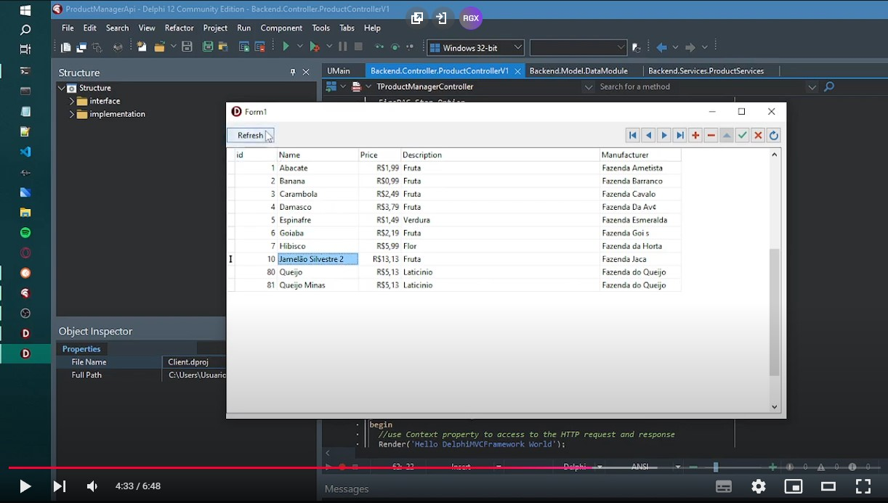
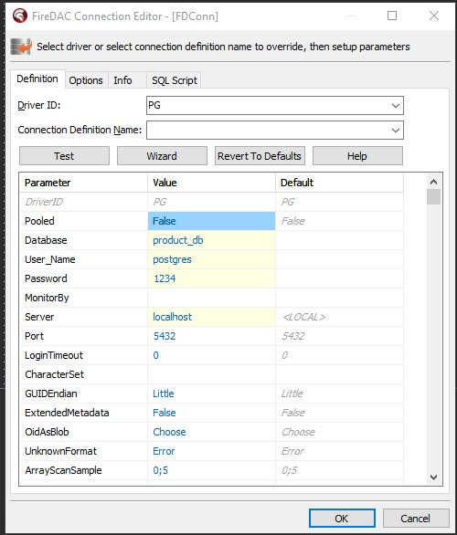
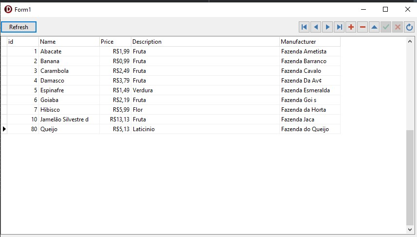

# Processo Seletivo Areco Sistema <> Desafio Delphi

## Sobre o Projeto

Neste repositório está localizado o código fonte do Desafio Delphi referente ao "Processo Seletivo Areco Sistema". Gavei um video abaixo com uma breve demonstração da aplicação em funcionamento. 


[](https://www.youtube.com/watch?v=7u-S1NHnfOg)


A Solução é composta de dos seguintes componentes:

#### Base de dados PostgreSQL

- Uma base de dados PostgreSQL, responsável por armazenar a tabela Product. Ela possui as seguintes colunas:
	- **`id`**: A Chave primária auto-incrementável;
	- **`name`** : Nome do produto;
	- **`price`**: Preço do produto;
	- **`description`**: Descrição do Produto;
	- **`manufacturer`**: fabricante do produto;

Em um primeiro momento utilizei a versão mais recente do PostgreSQL, porém por um problema que transcorreu durante o projeto, tive que utilizar uma versão um pouco mais antiga, a versão *10.23*. A página de download desta versão segue neste [link](https://www.postgresql.org/ftp/source/v10.23/).

Para criação da base de dados, disponibilizei um script SQL com as Queries para criação da base de dados. O Script está localizado [aqui](./Docs/sql/product_db.sql). Para criar a base de dados é bastante simples, basta executar a aplicação psql através do seguinte comando:

```
psql -Upostgres
```

Em seguida, recomendo executar comando a comando contido no arquivo sql.


#### Servidor com API REST "ProductManagerApi"

É o "core" do Projeto, e consiste em um servidor MVC com API Rest, com as operações de CRUD para atualização da base de dados. Foi desenvolvido utilizando-se o Fire DAC para a realização das conexões com a base de dados PostgreSQL. Uma limitação da aplicação atualmente é que as configurações de acesso a base estão harcoded:
 
Para a implementação do MVC foi utilizado o framework `DelphiMVCFramework_3.4.1-sodium`, que pode ser encontrado no Github por meio deste [link](https://github.com/danieleteti/delphimvcframework/releases/tag/v3.4.1-sodium).

Em termos de arquitetura, as classes desse componente todas estão contidas no namespace "Backend". As classes estão dispostas nos seguintes "pacotes":
- Data: classes de objetos de dados utilizados pela API, dispostos com em subpastas com os nomes nas versões da API REST;
- Services: Abstrai o serviço de acesso a base de dados a ser consumido pelo Controller.
- Model: dispus neste pacote as classes responsavel pelo acesso as base de dados e abstração dos dados da base; 
- Controller: Controller responsavel pelo gerenciamento da API REST. Também é responsavel por escolher qual serviço de acesso a base irá consumir. 


A API REST Suporta as seguintes operações:

	- **`GetAllProducts`**
	
		`GET`: `/api/v1/products`
		Parâmetros:

		> Sem Parâmetros

		Resposta Esperada:

```
		[
			{
				"id": 1,
				"name": "Abacate",
				"price": 1.99,
				"description": "Fruta",
				"manufacturer": "Fazenda Ametista"
			},
			{
				"id": 2,
				"name": "Banana",
				"price": 0.99,
				"description": "Fruta",
				"manufacturer": "Fazenda Barranco"
			},
			{
				"id": 3,
				"name": "Carambola",
				"price": 2.49,
				"description": "Fruta",
				"manufacturer": "Fazenda Cavalo"
			},
			...
		]
```


	- **`GetProduct`**

		`GET`: `/api/v1/product/${ID}`

		Parâmetros:

		- `${ID}`: ID do produto;

		Resposta Esperada:

```
		{
			"id": 2,
			"name": "Banana",
			"price": 0.99,
			"description": "Fruta",
			"manufacturer": "Fazenda Barranco"
		}
```

		
	- **`CreateProduct`**

		`POST`: `/api/v1/create

		Parâmetros:

		- Body:

```
			{
				"name": "Queijo",
				"price": 5.13,
				"description": "Laticinio",
				"manufacturer": "Fazenda do Queijo"
			}
```

		- Headers: `Content-Type:application/json`

		Resposta Esperada:

```
		Product Created
```

	- **`UpdateProduct`**
	
		`POST`: `/api/v1/update/${id}

		Parâmetros:

		- Body:

		```
			{
				"name": "Inga",
				"price": 7.77,
				"description": "Fruta",
				"manufacturer": "Fazenda Indaiatuba"
			}
		```

		- Headers: `Content-Type:application/json`
		Resposta Esperada:

		```
		OK
		```

	- **`DeleteProduct`**

		`POST`: `/api/v1/delete/${id}

		Parâmetros:

		- `${ID}`: ID do produto;

		Resposta Esperada:

		```
		OK
		```		

Para facilitar a realização de testes, eu disponibilizei as chamadas de API utilizadas no Postman durante o desenvolvimento. Estão localizadas [neste](./Docs/postman/Delphi.postman_collection.json) arquivo.

#### Aplicação Client

 

Utilitário Client para edição da base. Consome a API REST.


## Requisitos

- PostgreSQL 10.23;
- DelphiMVCFramework_3.4.1-sodium;
- Delphi 12


## Outros Projetos Pessoais

Com realação aos requisitos da vaga, tenho uma ampla experiência em C#, porém este é o meu primeiro contato com Pascal (exceto por livros textos, é claro, rs). Foi um grande desafio, e realmente foi gratificante aprender essa tecnologia! Tomei grande inspiração em um projeto de um curso online na Udemy sobre MVC e REST com SpringBoot que estou cursando. O Código dele está [aqui](https://github.com/AndersonPaschoalon/Online-Courses/tree/master/Udemy/RestWithSpringBootAndJava/Src/RestWithSpringBoot).

Meu principal projeto pessoal é um dos resultados de meu mestrado, a ferramenta "SIMITAR" (SIMITAR: SniffIng ModellIng and TrAffic geneRation).
É uma gerador de tráfego de rede capaz de emular as caracteristicas estocásticas, da camada de rede e transporte de um tráfego real. Mais sobre [aqui](https://github.com/AndersonPaschoalon/Simitar/tree/master/SIMITAR). Neste link tem um resumo de como a aplicação funciona, algumas figuras ilustrativas, e casos de uso. 

Também gosto de desenvolver por hobbie. Dentre estes projetinhos, o que pasticularmente, mais me orgulho é um conteúdo adicional (não oficial, chamados de Mods pela comunidade) que desenvolvi para um dos meus jogos favoritos, Skrim. O código desse projeto está [aqui](https://github.com/AndersonPaschoalon/Skyrim-DSilHand).

Por fim, tenho também o meu [portifólio pessoal](https://andersonpaschoalon.github.io), onde condenso informações de minha carreira, conquistas e também projetos pessoais. 


